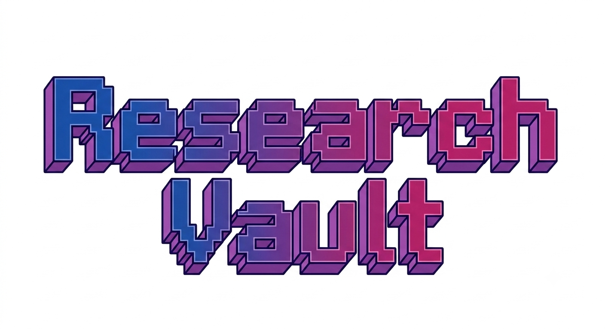
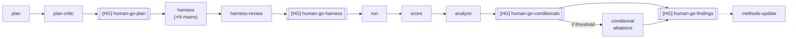
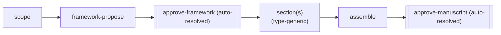

<h1 align="center"></h1>
<p align="center">
  <a href="https://pypi.org/project/research-vault/"></a>
  <a href="https://pypi.org/project/research-vault/"></a>
  <a href="https://www.gnu.org/licenses/agpl-3.0"></a>
  <a href="https://github.com/phoongkhangzhie/research-vault/stargazers"></a>
</p>


## An autonomous research crew you delegate to — not a tool you operate.

You hand Research Vault a research question. A hub agent — **Alfred** — plans the
work, dispatches a crew of specialists, and runs the full research loop:
literature review, experiment design, execution, analysis, synthesis. You stay in
the conversation and approve at the gates that matter. **You never drive the
research loop from the CLI — Alfred does.** (You run `rv init` once at setup; from
there you converse.)

The aim is to give the scientist space to **think and collaborate** with the crew —
not to worry about implementation and execution. The agents do the mechanical work;
a human stays in the loop where judgment matters; and the disciplines that make
research trustworthy are wired into the machinery so they *bite*.

**The discipline is the headline. The autonomy is the point.**

---

## The crew

One flat, vault-level crew — six named specialists, each a hat composed from a
shared charter plus a role doctrine. You talk to **Alfred**; Alfred coordinates
the rest.

**Alfred** — *Hub.* After Alfred Pennyworth, the butler who runs the household. The
single front door and **sole orchestrator**: the only agent that walks the DAG and
the sole spawning authority. He plans the work, dispatches the crew, and surfaces
every decision that needs you — and he never executes code or merges anything
himself.

**Wren** — *Architect.* After Sir Christopher Wren. Owns the stack and the
architecture map; vets every new dependency and keeps the system coherent. Wren
designs — he doesn't lay stone.

**Mason** — *Engineer.* The master stonemason. Builds the code: features, tests,
CI, and the authorized merge. Wren draws the plans; Mason builds them.

**Ada** — *Researcher.* After Ada Lovelace. The science itself — literature review,
experiment design, retrieval-backed citations, analysis, and synthesis.

**Argus** — *Reviewer.* After Argus Panoptes, the hundred-eyed watchman.
Independent verification: adversarial review and the honesty gates. Read-only by
construction — and no agent reviews its own work.

**Iris** — *Designer.* After Iris, goddess of the rainbow and messenger of the
gods. Figures and the surfaces through which the work reaches the world.

Least-privilege is stamped into each hat: coordinator-class hats get no shell
(structural, not disciplinary), the reviewer is read-only, and the researcher
carries web retrieval for support-checked citations. **Nobody merges on their own
authority** — a merge executes only when an independent gate authorizes it.

---

## How you actually use it

Once you've run `rv init`, you never drive the research loop yourself. It is a
conversation:

1. **You describe the work** to Alfred in natural language — a question to
   investigate, a literature space to map, an experiment to run.
2. **Alfred walks the DAG** — he plans the research loop, dispatches each node to
   the specialist whose hat fits it (Ada for the science, Mason for the harness,
   Argus for verification, Iris for figures), and threads the artifacts between
   them.
3. **You approve at the gates** — at each human-go gate Alfred pauses, hands you an
   evidence packet, and waits. Nothing clears the gate without your explicit go;
   the crew cannot approve its own work.

The `rv` command line exists — but it is **Alfred's control surface**, not a human
keyboard interface. You converse; Alfred runs the verbs. (The full verb reference
is [below](#the-crews-control-surface), for the curious.)

---

## Why it exists

Most "AI research assistant" tooling optimizes for output volume. The failure
mode of an LLM in research is not slowness — it's *confident fabrication*: an
invented citation, a metric that never traces to a run, a "passing" check that is
green-and-empty, a result banked because it looked clean. Research Vault is built
around stopping exactly that, mechanically:

- **Anti-fabrication.** Every specific — a number, a citation, a file — must
  trace to a real source. A citation needs a real retrieval, support-checked, not
  recalled from memory.
- **Every outcome is a finding.** A null result is a result. The loops are built
  to reach and record an honest null, not to fish for a positive.
- **Verify the artifact, not the signal.** "CI is green" is a claim to check
  against the artifact, never a fact to relay. A completed node is verified by its
  produced artifact's freshness, not by an agent's say-so.
- **Honest pre-registration.** The confirmatory plan is frozen (a content hash)
  *before* the run, and edits to the frozen set are caught structurally.
- **Human-only approval.** The crew cannot approve its own work. The approval gate
  is a mechanical trust boundary keyed on an interactive terminal — a dispatched
  agent has no TTY and is refused, regardless of flags.

Each discipline maps to a command and a gate. The code is the proof those
disciplines are actually runnable; they are not slogans in a CONTRIBUTING file.

---

## Where it fits

Research Vault stands on a wave of work exploring agentic research and discovery —
systems that let agents plan, run, and reason about scientific work:

- **AlphaEvolve** — [A Gemini-powered coding agent for designing advanced
  algorithms](https://deepmind.google/blog/alphaevolve-a-gemini-powered-coding-agent-for-designing-advanced-algorithms)
  (DeepMind)
- **AutoResearch** — [Andrej Karpathy](https://github.com/karpathy/autoresearch)
- **The AI Scientist-v2** — [Workshop-Level Automated Scientific Discovery via
  Agentic Tree Search](https://arxiv.org/abs/2504.08066)
- **AutoResearchClaw** — [aiming-lab](https://github.com/aiming-lab/AutoResearchClaw)

Our emphasis is a deliberate choice, not a verdict on any of these: **discipline
and doctrine, with a human in the loop.** We want to give the scientist room to
*think and collaborate* with the crew — freed from the mechanical work of
retrieval, harness-building, running, and analysis, but never removed from the
judgment. The agents do the mechanical work; the disciplines (anti-fabrication,
honest pre-registration, verify-the-artifact, human-only approval) keep it
trustworthy; and the human stays where human judgment belongs — the questions, the
design, and the gates.

---

## What the crew runs — the three loops

Research Vault ships **three** research loops as DAGs. Alfred walks each one node
by node, dispatching every node to the specialist whose hat fits it. Two of them
**build** `notes/` (the crew's reasoning pillar); the third **transforms** `notes/`
into a submittable document (the user-facing deliverable pillar).

### Literature review (`rv review`)

A pre-registered, saturation-gated review. The protocol must be approved before
search fires (L-2 anti-fishing gate); a deterministic width-sweep (`review-search`)
is screened by a thin agent judgment layer (`review-screen`) before the
deterministic snowball walks forward (cited-by) and backward (references)
(`review-snowball`), whose raw corpus is then concept-tagged and curated
(`review-curate`); Phase-2 relate nodes fan out over every in-scope paper.
OKF outputs: `literature/*.md` notes, `concepts/`, `mocs/`, and typed gap notes.

```mermaid
flowchart LR
    scope[review-scope] --> HG1[["[HG] approve-protocol"]]
    HG1 --> search[review-search] --> screen[review-screen] --> snowball[review-snowball]
    snowball --> curate[review-curate]
    curate --> GATE2[["coverage-gate (auto-resolved)"]]
    GATE2 --> relate["relate-*\n(Phase-2 fan-out)"]
    relate --> synthesize[review-synthesize] --> critic[review-coverage-critic]
    critic --> GATE3[["approve-review (auto-resolved)"]]
```



### Experiment (`rv experiment`)

A pre-registered study. The plan is critiqued and frozen before any harness is
built; each main's harness is reviewed independently before the run fires; results
gate conditional ablations; all findings are ratified before write-up.
OKF outputs: `experiments/*.md` (pre-reg), `findings/*.md`.



### Manuscript (`rv manuscript`)

Turns a saturated `notes/` corpus into a submittable document, **by type**
(`type: lit-review` — a survey/review paper — ships today; a future
`type: experiment-paper` is designed for, not built). The organizing framework
is a human commitment, never machine-discovered; every draft/revise round
re-fires hard fidelity gates (hermetic references build, citation-resolve, coverage,
equation-fidelity) and, when a judge is configured, LLM-judged support-matcher +
cold-read gates; a 2-round × 3-reviewer conference-style board scores FLOOR axes
by MIN-across-3 (never average) plus a **mandatory** annotated-bibliography
canary that must not clear. OKF inputs: `literature/`, `concepts/`, `mocs/`,
`gaps/`. Output: `manuscripts/<slug>/{report.md, sections/, references.md, figures/}`
(markdown only — no LaTeX).



See [doctrine/manuscript-loop.md](src/research_vault/data/doctrine/manuscript-loop.md)
for the full walkthrough (scaffold → framework approval → expand → the 2×3
review board → the fidelity gates → the manuscript output) and its known
limitations.

All three loops use the same underlying machinery: a DAG walker over typed nodes,
with a grounding manifest that binds each node to the artifacts it reads and
produces. `[HG]` nodes are **human-go gates** — the points where Alfred pauses and
waits for you. Only **one** gate is ever human in the lit-review and manuscript
loops: `approve-protocol` (Gate 1, the pre-registration checkpoint before any
search fires). Every downstream gate (`coverage-gate`, `approve-review`,
`approve-framework`, `approve-manuscript`) resolves **autonomously** through the
gate-policy engine (`review/autonomy.py`) — the user receives the manuscript as
the system's best version, with no "approve the result" gate and no
provisional/vetoable bookkeeping. The experiment loop's four `[HG]` gates
(pre-registration + per-main harness review + conditionals + findings) remain
fully human — that loop's autonomy program is a separate, not-yet-built effort.

---

## The crew's control surface

Everything below is what **Alfred** runs on your behalf. You don't type these — but
they are readable, so you can see exactly what the coordination is made of.

### How a loop runs (the DAG walk)

Alfred walks the DAG one dispatchable node at a time, using a **deterministic brief
emitter** so no dispatch is hand-transcribed (hand-transcription is where context
drifts):

```bash
rv dag status <run_id>              # 1. identify the next node (PENDING; reads verified)
rv dag brief  <run_id> <node_id>    # 2. emit the deterministic dispatch brief
#                                      3. dispatch that brief verbatim to the crew agent
rv dag complete <run_id> <node_id>  # 4. record SUCCEEDED/FAILED; the walker advances
rv dag tick   <run_id>              #    advance the frontier to the next gate
rv dag approve <run_id> <node_id>   #    human-go: the solo decision gate
```

The brief is a *pure function* of the node plus run state — byte-identical given
the same inputs — so what a crew agent receives is grounded in resolved absolute
paths, not a re-typed summary.

### Core capabilities

- **DAG research loops** with typed nodes, afterok/watch edges that gate on
  artifact freshness, and in-session resolution (no background pollers/daemons).
- **Deterministic crew briefs** (`rv dag brief`) — every dispatch carries a fixed
  structural preamble (role framing, anti-fabrication, the return schema) plus the
  node's spec and resolved read/write paths.
- **K-3 pre-registration freeze** (`rv plan check`, `rv plan freeze`) — a
  structural shape-lint (no empty/TBD/"fallback" diagnosis cells;
  one-component-per-ablation) *before* the human-go, then a content hash of the
  confirmatory `covers:` set that is re-verified at findings — a post-freeze edit
  to the frozen set is caught, not trusted.
- **Cross-project corroboration** — Alfred declares a genuine edge between projects
  (`rv project relate <a> <b> --kind <why>`), then `rv research corroborate` ranks
  candidate evidence across declared peers by TF-IDF, an LLM judge confirms each,
  and a human reviews. Never auto-asserted.
- **The mechanical approval trust boundary** (`rv approval`, `rv dag approve`) —
  `security = stdin.isatty()`, full stop. A signed token path exists for
  non-interactive operators, but the crew cannot self-approve by construction.
- **OKF typed notes** — 8 note types (literature, concepts, methods, experiments,
  findings, mocs, datasets, gaps). Notes are *pointers*, not embeds: a datasets
  note points to its artifact (path/URL/DOI + content hash), never contains it.

---

## Install

```bash
pip install research-vault      # a lean 29-package research toolkit
rv --help
```

The `rv` CLI and every verb run clean even with the toolkit absent (all toolkit
imports are lazy) — so `pip install research-vault --no-deps` works, and
`rv bootstrap` populates an isolated `.venv` if you need the full stack later.

The 29-package core covers the model seam (**litellm** as the unified provider
interface, plus the Anthropic SDK and a tokenizer), analysis (pandas, numpy,
pyarrow, scipy, statsmodels, datasets), eval (inspect-ai, evaluate, sacrebleu,
rouge-score), a multilingual set, integrations (**wandb** + **weave** for
experiment tracking and automatic call-trace observability, **pyzotero** +
**keyring** for Zotero citation management), and harness utilities. GPU-fragile local
inference (torch, transformers, …) is **opt-in** behind an extra — it is never
installed by default (CUDA-pinned wheels break CPU-only machines):

```bash
pip install research-vault[local]              # local GPU inference
pip install research-vault[local,serve-vllm]   # + a serving stack
```

Per-provider SDKs (openai, google-genai, …) and plotting libraries are **not**
shipped — install them directly at your discretion. `litellm` covers most API
targets without a dedicated SDK.

### Prerequisites

- **Python 3.12+**
- **An agent runtime — the ONE hard requirement.** Claude Code (see *Quick start*
  below). There is **no required API key**: with the runtime installed and zero keys,
  `rv check` is GREEN (exit 0) and you can start immediately.

Everything else is a **feature** you unlock when you need it. A missing feature key is
never a failure — it is **locked until you add the key**:

| Feature | Unlocks | Get a key / access |
|---|---|---|
| Provider API key(s) | API-model experiments (any ONE provider) | console.anthropic.com/settings/keys · platform.openai.com/api-keys |
| s2 | `rv research find` retrieval | semanticscholar.org/product/api |
| asta | `rv research find --deep` | share.hsforms.com (asta MCP access) |
| wandb | experiment observability + `rv wandb pull` | wandb.ai/settings |
| zotero | `rv cite` | zotero.org/settings/keys |
| compute | remote-cluster experiments | `rv compute init` |

Provider keys are **provider-plural** (Anthropic, OpenAI, …). The **asta** access
request needs an **institutional email** (not a personal gmail). Run **`rv onboard`**
for a guided, idempotent setup that stores each key in your system keyring (never a
plaintext file), and **`rv check`** to verify — it points to `rv onboard` for anything
still locked. `wandb`, `pyzotero`, and `keyring` are core pip dependencies; `asta` is
the one external prerequisite that is not a pip dep.

---

## Quick start

Research Vault runs on **Claude Code**.

```bash
pip install research-vault
rv init myvault      # scaffold a new vault
cd myvault           # enter it
rv onboard           # guided setup: keys, compute, inline-approval token
rv start             # launch Claude Code as Alfred in the vault
```

`cd` must come before `rv onboard` — onboarding writes the compute manifest into
the vault, so it runs from inside. (`rv init` can't cd you in; a subprocess can't
change the parent shell.) Onboarding is optional and re-runnable — the runtime
alone is enough to start; `rv init` also offers to run it for you at the end.

On **Claude Code**, `rv init` scaffolds a `CLAUDE.md` and the crew under
`.claude/agents/`, rendered with per-role tool grants and model aliases — so your
session boots as **Alfred** (the hub), the coordinator you converse with, and the
role hats become the subagents he dispatches. The human-only approval boundary
holds mechanically: the approve-gate keys on an interactive TTY, which dispatched
crew subagents never have.

`rv init` writes a
**[`QUICKSTART.md`](src/research_vault/data/templates/QUICKSTART.md)** into the
vault — the full walkthrough, including compute onboarding and an example session
with Alfred. A real project is its own git repo; register it with `rv project add`
(or stand up a fresh one with `rv project new`). After a
`pip install --upgrade research-vault`, run **`rv update`** to pull the upgraded
framework (doctrine, `CLAUDE.md`, the crew hats) into an existing vault — your
notes, projects, and edits are preserved.

---

## Status

This is **alpha**. The architecture is complete and the loops run end-to-end. It
is not battle-tested across many adopters yet, and it is evolving. The disciplines
are enforced by code you can read.

## License

AGPL-3.0-or-later. See [LICENSE](./LICENSE). (Relicensed from MIT at v0.3.0 —
see DEVLOG.md 2026-07-08. Releases 0.1.0-0.2.8 remain MIT for already-
distributed copies; the flip is go-forward only.)

## Contributing

See [CONTRIBUTING.md](./CONTRIBUTING.md). One rule above the rest: **changes to a
discipline are doctrine changes** — they go through the doctrine, not around it.
</content>
