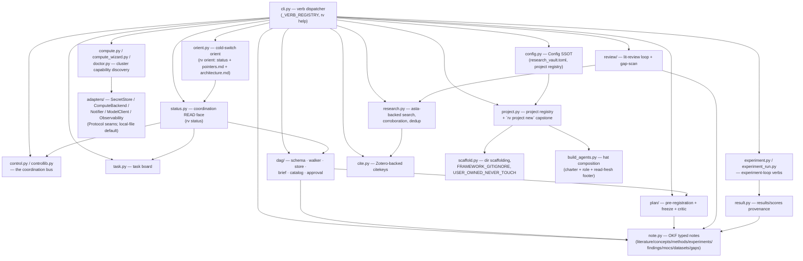

# Architecture — research-vault

The architecture of record for the `rv` package. Kept current with the code — an
update here rides in the same PR as the change it describes (see
`doctrine/tooling.md`'s architecture-map discipline). This is a **living, minimal**
map, not an exhaustive one: it orients a cold reader to the shape of the system,
then points at the code and doctrine for the rest.

**research-vault is a STANDALONE public OSS package.** The live operator vault
(`~/vault`) is **not** a dependency, not refactored, not imported — that boundary
is a v1 acceptance check and stays true here.

## What it is

`rv` is an adoptable, zero-infra AI-research-assistant OS framework: a CLI core
(`rv`) + portable doctrine + a named crew (Alfred/Wren/Mason/Ada/Argus/Iris — see
`README.md`) + typed OKF notes + a DAG orchestrator + both research loops
(experiment and lit-review) + a file-based control plane. A stranger clones it,
runs `rv init`, and gets the full research loop with zero infrastructure —
file-based local-default adapters, optional capabilities behind extras.

## Components

## The two research loops

Both loops compose the **same DAG mechanism** (`dag/schema.py` + `dag/walker.py` +
`dag/store.py`) — a standing constraint (zero new walker machinery per loop):

- **Experiment loop** — `experiment.py` / `experiment_run.py` / `plan/` /
  `result.py`. Pre-registration (`plan freeze`) → run → `results/scores/*.csv`
  provenance (hashed frontmatter, not a prose path) → human-go completion gate.
- **Lit-review loop** — `review/` (`review/__init__.py`, `review/gap_scan.py`).
  Phase-1 static DAG (scope → approve-protocol → search → snowball →
  coverage-gate) → phase-2 fan-out emitted by `cmd_expand` after human approval
  (a runtime-discovered set can't be a static manifest node — resolved by the
  two-phase split, not new DAG mechanism).

## Data flow (by verb, not exhaustive)

| Stage | Input | Output | Verb |
|---|---|---|---|
| Register a project | slug/code/source_dir | `[projects.<slug>]` in `research_vault.toml` | `rv project add` / `rv project new` |
| Cite a paper | DOI/arXiv id | `library.json` entry + `literature/<key>.md` | `rv cite add`, `rv research add` |
| Note the corpus | papers | `literature/`, `concepts/`, `methods/` notes | `rv note new` |
| Run an experiment | a pre-registered plan | `experiments/<slug>.md` + `results/scores/*.csv` | `rv dag run`, `rv experiment` |
| Verify provenance | `results_location` + `results_hash` | pass/fail | `rv note check`, DAG complete-gate |
| Coordinate the crew | Inbox/Handshakes/Outbox | `control/<slug>.md` | `rv control` |
| Read project state | control + task board + git + DAG | one coordination read | `rv status` |
| Cold-switch orient | `rv status` read + pointers.md + architecture.md | one strategic orient | `rv orient` |

## OKF note types (`note.OKF_TYPES`)

**8 types, project-scoped** except `datasets` (the sole shared type, lives in
`cfg.datasets_root`): `literature`, `concepts`, `methods`, `experiments`,
`findings`, `mocs`, `datasets`, `gaps`. Notes are **pointers**, never embeds — a
`datasets/` note carries `location` + `hash`, never the data itself.

## Project folder structure (the CS-project convention, PR-1/PR-2)

Every `rv project new` scaffolds the repo-root convention documented in
`doctrine/project-structure.md`: `notes/` (OKF types + `log/`), `code/{src,tests,tools}/`
(freely refactorable — nothing links into it), `data/` (raw inputs), `results/{runs,scores}/`
(runs=gitignored evidence trail, scores=tracked SSOT), `figures/` (tracked, designed
deliverables), `manuscripts/`, plus `architecture.md` / `pointers.md` / `DEVLOG.md` /
`library.json` / `.agents/` / `.claude/` at the root. `scaffold.USER_OWNED_NEVER_TOUCH`
protects the human-authored files (`architecture.md`, `DEVLOG.md`, `pointers.md`, …) from
`rv update` clobbering.

## The control plane + coordination-context read-fresh

One flat, vault-level crew (charter + role doctrine, built once at `rv init` — no
per-project lens baked into a hat). Project context is **read fresh** at work
time from three sources (`doctrine/coordination.md`):

- `rv status <slug>` — the tooled coordination READ face (control sections,
  task board, DEVLOG tail, local git, DAG runs, a `pointers.md` head echo).
  **Never** hand-`cat`/`Read` `control/*.md` — that parses stale prose and
  misses live state (the SR-4-mistaken-for-undispatched incident).
- `<source_dir>/pointers.md` — the project's read-fresh pointer file: Identity
  · ★ POINTERS · Roadmap · Team · Operational-state (the blessed MUST-contain
  skeleton `rv project new` scaffolds; see `orient.py`'s docstring).
- `<source_dir>/architecture.md` — this file's per-project sibling, the
  component/data-flow map.

**`rv orient <slug>`** (this file's own consumer) is the one-shot cold-switch
primitive: it bundles the `rv status` read + the FULL `pointers.md` content +
the `architecture.md` head, so switching to (or cold-orienting to) a project is
one call instead of a 3-step manual ritual.

## Adapters — Protocol seams, local-file default

`adapters/` defines Protocol interfaces (`SecretStore`, `ComputeBackend`,
`Notifier`, `ModelClient`, an observability seam) with **zero-infra local/file
defaults**; a provider-backed implementation (keyring, ssh+slurm, litellm,
weave/wandb) is an opt-in extra, never a core dependency. `compute.py` /
`compute_wizard.py` / `doctor.py` discover cluster capability without assuming
one exists.

## Config plane

`config.py` is the sole SSOT for path resolution — every verb resolves paths
via `Config`, zero hardcoded paths or codenames. Resolution precedence:
`--config PATH` → `RESEARCH_VAULT_CONFIG` env var → CWD walk-up to
`research_vault.toml`. The project registry (`config["projects"]`) maps
slug → `{code, source_dir, roster, ...}`; `cfg.project_notes_dir(slug)`
resolves `source_dir` directly (no `notes_root / slug` indirection).

## Doctrine (`data/doctrine/`, shipped in the wheel via `rv init`/`rv update`)

`agent-charter.md`, `coordination.md`, `project-structure.md`,
`note-conventions.md`, `review-board.md`, `standards.md`, `tooling.md`,
`memory-management.md`, `honesty-gates.md`, `crew-cannot-self-approve.md`,
`git-discipline.md`, `compute-run-recipe.md`, `plan-critic-spec.md`, plus
per-role docs under `doctrine/roles/`. `rv lint`'s rule 8 enforces doctrine
link-integrity (zero dangling cross-references) as a CI gate.

## The standalone boundary + leakage-by-construction

Two structural constraints that hold the package's OSS shape:

- **No `~/vault` coupling.** Nothing in `src/research_vault/` imports from or
  hardcodes a path into the operator's private vault instance.
- **Leakage gate.** CI scans package data (`doctrine/` + `examples/` +
  `templates/`), `DEVLOG.md`, and public-bound root files (`README.md`,
  `architecture.md`, `QUICKSTART.md`, `REFERENCES.md`, `SETUP.md`, `LICENSE`,
  `pyproject.toml`, `RELEASING.md`) for private markers — codenames, identity
  strings, cluster paths, secret-shaped strings, versioned model IDs. A gate
  with teeth, not a guideline (`scripts/leakage_scan.sh`).

## Key decisions

- **Zero new DAG mechanism.** New loops (manuscript, plan, review) compose the
  existing schema/walker/store + `spec:`/`reads:` grounding manifest — never
  add walker machinery.
- **Config-driven, not hardcoded.** Behaviour (per-section tips, plan tips,
  style preambles) flows through named config seams, not inline constants.
- **Fresh dispatch by default; resume is the justified exception** — see
  `doctrine/coordination.md`'s dispatch section.
- **architecture.md was deleted, then re-blessed.** A July-2026 "overkill for
  public package" pass removed this file entirely; the CS-project-structure
  convention (PR-1/PR-2) re-introduced `architecture.md` as a scaffolded,
  USER-OWNED per-project artifact — this file is rv dogfooding its own
  convention on itself.

## Open questions

- _(fill in open architectural questions as they arise)_
