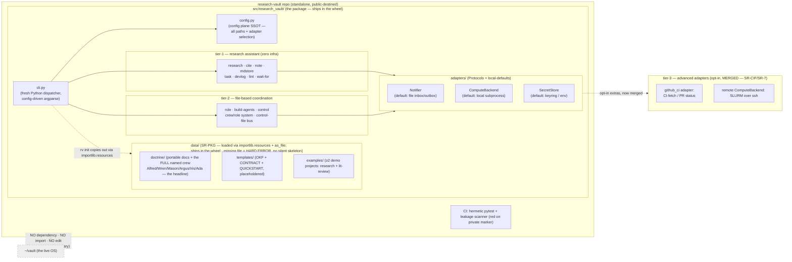

# Architecture — research-vault (Research Vault)

The technical map of record. Owned by the Principal Architect; kept current with the code in the same
change. **Research Vault is a STANDALONE public OSS package** — built fresh, like any project. The live
`~/vault` is **NOT a dependency, NOT refactored, NOT imported** — that boundary is a v1 acceptance check.

## The standalone boundary

**Package-data layout (SR-PKG, #22 part 1 / merged #46).** `doctrine/`, `templates/`, and `examples/`
are **not** top-level repo boxes — they live under **`src/research_vault/data/`** *inside* the package,
so they ship in the wheel. `rv init` reads them via **`importlib.resources.files("research_vault") / "data"`
+ `as_file()`** (zipimport-safe: works from a regular install AND a zipped wheel). The old `__file__`-based
skeleton fallbacks are **gone** — a missing data file is a **HARD ERROR**, not a silently-degraded skeleton
(charter §2: surface, never silently drop; `init.py:17-22`).

## Tiers
| Tier | Surface | v1? |
|---|---|---|
| 1 — research assistant | research, cite, note, mdstore, task, devlog, lint, wait-for, dag + the loops (manuscript, review, plan, figure, wandb, compute, doctor) + the doctrine | YES |
| 2 — file coordination | status, role, build-agents, control, crew/role system, control-file bus, notify | YES |
| 3 — advanced (opt-in) | github CI fetch (`adapters/github_ci.py`, MERGED), remote ComputeBackend / SLURM (MERGED); vcs multi-identity PR/merge | partial |

## OKF typed notes — 9 types (note.OKF_TYPES, the SSOT)
`note.OKF_TYPES` (`note.py:26-36`) is the frozen SSOT: **9 types** — `literature`, `concepts`, `methods`,
`experiments`, `findings`, `mocs`, `datasets` (SR-8), `figures` (SR-FIG), `manuscript` (SR-MS-1a). Notes are
**pointers, not embeds** (a figures/datasets/manuscript note *points to* its artifact, never contains it).
**Scoping** is governed by `note.OKF_SHARED_TYPES = {"datasets"}` (`note.py:43`) — `datasets/` is the sole
**shared** cross-project root (lives in `cfg.datasets_root`); **all other 8 types are project-scoped**
(`cfg.project_notes_dir/<type>`). This split is imported, never duplicated (consumers: `wait_for` note-resolver,
`dag/verbs` scope-check).

## The loops & manuscript layer — the generative research OS (merged on top of core)
Four subpackages, each a **DAG-driven loop** composed on the SR-3 walker/store + `spec:`/`reads:` grounding
manifest with **zero new DAG mechanism** (the standing constraint). Each carries a **config seam** (Ada-authored
prompt defaults + adopter override) and a `style.py` `apply_style`/style-preamble seam.

| Subpackage | Verb | What it does | Config seam |
|---|---|---|---|
| `manuscript/` | `rv manuscript new/compile/check/list` | Grounded LaTeX drafting: `support_matcher` (`[SUPPORTS]`/`[PARTIAL]`/`[ABSENT]`/`[CONTRADICTS]` verdict per `\cite`→source, verbatim-span-or-BLOCK) · `naked_cite` (uncited-claim scan) · `check_gates` · `bib` (closed `.bib` from `literature/` notes) · `results_inject` (machine-injected `\result*` macros, hash-verified `experiments/` reads) · `appendix` · guarded `compile` | `per_section_tips` + `style.py` |
| `review/` | `rv review new/expand/list/gap-scan/gap-scope/gap-close` | Pre-registered, **saturation-gated lit-review DAG**: Phase-1 (review-scope → `[HG:approve-protocol]` → review-search → review-snowball → `[HG:coverage-gate]`) with `_protocol.md` freeze (non-empty `counter-position` = L-2 anti-fishing gate) + internal saturation loop (forward cited-by + backward refs); **two-phase fan-out** via `rv review expand` after the coverage human-go. **SR-LR-2 gap-driven pass**: `gap_scan.py` detects four typed gaps (knowledge_void / contradictory / evaluation_void / absent_row); `gap-scan` is a **rejects-only screen** that writes `gaps/<id>.md` (10th OKF type, first-class lifecycle); `gap-scope` auto-authors a targeted Part-1 scope (question←claim, seed_queries, snowball_seeds); `absent_row` detector binds to `RunState.meta['support_matcher']` structured verdicts — NOT prose-grep (the loop-closer: manuscript↔lit-review cycle, §5L.10) | `review_tips` + `style.py` |
| `plan/` | `rv plan check/tips` | Pre-registration **freeze** (`freeze.py`) + structural **shape-lint** (`check.py`): rule (a) branch-presence, rule (b) one-component-per-ablation, **rule (c) bare-id `covers:` convention (SR-PLAN-2)** — run BEFORE `human-go-plan` | `plan_tips` + `style.py` |
| `figures/` | `rv figure new/preview/render/recommend/list` | scores/datasets → publication-quality figures over pandas; `recommend` ranks plot types on the Cleveland–McGill perceptual ladder + Mackinlay expressiveness (SR-FIG-REC); provenance = `figures/` note (experiment-results-hash + filter recipe + style preset) | `apply_style(preset, skin)` seam (Iris style module + BeautifulFigures [MIT, attributed]) |

**Dependency posture:** `figures/` bears RV's first optional extra — `[figures] = matplotlib/seaborn/pandas`
(import-guarded); manuscript `compile` uses a documented **texlive prerequisite**, not a core dep. **Core stays
stdlib-only.** Every loop above obeys leakage-by-construction (no private markers in prompts/seams/DEVLOG).

## Adapter Protocols (adapters/base.py)
| Adapter | Interface | Local-default (zero infra) | Advanced adapter |
|---|---|---|---|
| Notifier | `notify(msg, severity)` (+ optional `push_brief`) | file inbox/outbox (`state/inbox.jsonl` + `desk.md`) — **the ONLY impl; NO telegram/bridge anywhere** (rescope #4) | — |
| ComputeBackend | `submit(job)->handle` · `status(handle)` | local subprocess; artifact-verify = file check | remote SLURM over ssh (`adapters/remote.py`, SR-7 — **MERGED**) |
| SecretStore | `get(name)` · `set(name)` | `keyring` lib OR `$ENV` + gitignored dotfile (cross-platform) | macOS Keychain (later) |

The wait between submit and in-session verify is a backgrounded **`wait-for <condition>`** (§R) — one
main session + background shells, no daemon/poller/registry. Subagents submit-and-return; they never
block on an external job.

## Leakage-by-construction (the public-repo guarantee)
No dependency-direction tooth (there is no instance↔framework dependency). The guarantee is: the repo is
built fresh and contains no private data, enforced by (1) config-points-outward / zero hardcoded paths +
codenames; (2) a CI leakage scanner — private markers / secrets / non-template agent-memory → RED build;
(3) placeholdered + linted templates. Acceptance: `rv init` → a valid stranger-runnable instance.

## SR sequence (build plan)
Status verified against merged `main` (`src/research_vault/` modules + `note.OKF_TYPES`). **15 SRs merged.**

| SR | What | Status |
|---|---|---|
| SR-1 | Package scaffold + config plane + dispatcher + `task`/`note`/`control`/`devlog` | MERGED |
| SR-2 | Remaining verbs + `wait-for` + adapter Protocols + local-defaults + plugin seam | MERGED |
| SR-3 | DAG core (walker/store/schema/reads) + OKF typed-artifact coupling | MERGED |
| SR-4 | Leakage gate teeth + portable doctrine + FULL named crew (the SPINE) | MERGED (human-go) |
| SR-5 | Both example loops + multi-project structure + `rv init` + preflight | MERGED |
| SR-NEW | `rv project new` capstone — stands up ONE new project as its own git repo (register-first + rollback) | MERGED |
| SR-6 | `rv compute` / `rv doctor` — compute-discovery manifest + env probing/caching | MERGED |
| SR-7 | Remote `ComputeBackend` (`adapters/remote.py`) + cleanup + `native_env` | MERGED |
| SR-8 | DATASETS as a typed OKF artifact (shared root) + data-processing seams | MERGED |
| SR-WB | `rv wandb pull` — W&B results core (server holds data, vault holds index, pull by id) | MERGED |
| SR-FIG | FIGURES — data→figure DAG capability; `[figures]` extra; `figures/` OKF type (+ SR-FIG-REC recommender + fix) | MERGED |
| SR-CIF | Tier-3 CI fetch (`adapters/github_ci.py`) — reworked | MERGED |
| SR-EXP-REPRO | Experiment `repro_*` provenance schema | MERGED |
| SR-PLAN-1/2 | Plan/freeze module + pre-registration + shape-lint (rule (c) bare-id `covers:`) | MERGED |
| SR-MS-1a/1b/2 | Manuscript layer: structure · `.bib`+results-inject+guarded compile · support-matcher + critic + hash-drift gate | MERGED |
| SR-LR-1 | Lit-review loop (`review/`) — saturation-gated, two-phase fan-out | MERGED |
| SR-LR-2 | Gap-driven pass (`review/gap_scan.py`) — four typed detectors, `gaps/` OKF type, loop-closer (absent_row bound to structured `support_matcher` verdicts) | MERGED |
| corpus-dedup · SR-RESOLVE-SCOPE | Corpus dedup · project-scoped-vs-shared OKF split (`OKF_SHARED_TYPES`) | MERGED |
| SR-CONTRACT → SR-LENS-RM (#64) | project-lens scaffold, then **REVERSED**: per-project lens + `_hub.lensByRole` + per-project hat-bake removed — ONE flat vault crew, hats = `charter + role`, project context read fresh | MERGED |
| SR-CCB | Claude Code binding — `rv init` writes `CLAUDE.md` + populates `.claude/agents/` via `build-agents --target claude-code`; per-role tool grants + model aliases (PUB-CCB.2) | MERGED |
| — next → | SR-FIG-REC polish · SR-PLAN-2 follow-ons · SR-10 (OSS docs site + README/LICENSE + public publish, human-go) | — |

## Crew generation & the emit path (SR-LENS-RM, #64)
**One general, VAULT-LEVEL crew — not one crew per project.** Each hat is composed **`charter + role`**
only (`_compose_hat`, `build_agents.py:67`) and built **once at `rv init`**, flat. The old per-project
CONTRACT lens, the per-project hat-bake branch, the `_hub.lensByRole` selection, and the
first-project-pick namespacing hack are **all removed** (#64). Project emphasis is **not baked** — it is
**read fresh** at work time. The 6 vault roles are `_VAULT_ROLES = DEFAULT_ROSTER + ["architect"]`
(`build_agents.py:250`).

**Two coexisting targets, one composed source.** `.agents/<role>.md` is the neutral source-of-record;
`.claude/agents/<role>.md` is the Claude-Code-rendered *projection* (both emitted by `rv build-agents`,
selected by `--target`). The `AgentBackend` seam (`render(role, composed_body) -> [(relpath, contents)]`)
is where v1.1 `codex`/`cursor`/`generic` backends slot in — same composed body, different path/format.

**CC tool-grant policy (PUB-CCB.2 — least-privilege).** The `claude-code` projection stamps YAML
frontmatter per role: **coordinator-class** (architect) gets **no `Bash`** (structural, not
disciplinary); **doer-class** (engineer, designer) gets `Bash` + role tools; **reviewer** is read-only
(`Read, Bash, Grep, Glob` — no Write/Edit); **researcher** carries `WebSearch`/`WebFetch` for
retrieval-backed citations. Model values are **aliases only** (`sonnet`/`opus`/`haiku`) — never a
versioned ID (leakage class-6); researcher + reviewer baseline **opus**.
