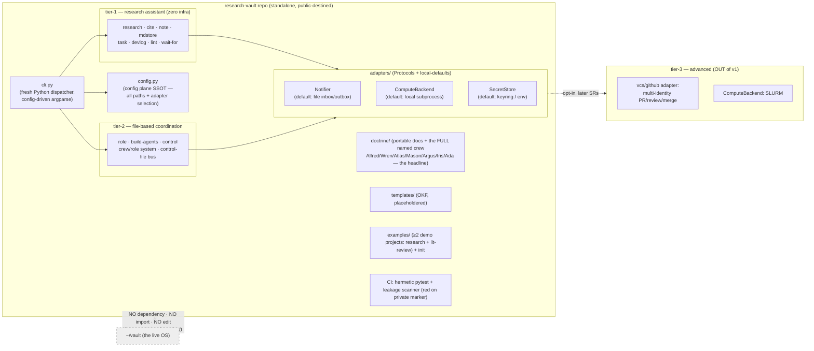

# Architecture — research-vault (Research Vault)

The technical map of record. Owned by the Principal Architect; kept current with the code in the same
change. **Research Vault is a STANDALONE public OSS package** — built fresh, like any project. The live
`~/vault` is **NOT a dependency, NOT refactored, NOT imported** — that boundary is a v1 acceptance check.

## The standalone boundary

## Tiers
| Tier | Surface | v1? |
|---|---|---|
| 1 — research assistant | research, cite, note, mdstore, task, devlog, lint, wait-for + the doctrine | YES |
| 2 — file coordination | role, build-agents, control, crew/role system, control-file bus, notify | YES |
| 3 — advanced (opt-in) | vcs/github (multi-identity PR/merge), SLURM backend | NO (later SRs) |

## Adapter Protocols (adapters/base.py)
| Adapter | Interface | Local-default (zero infra) | Later adapter |
|---|---|---|---|
| Notifier | `notify(msg, severity)` (+ optional `push_brief`) | file inbox/outbox (`state/inbox.jsonl` + `desk.md`) — **the ONLY impl; NO telegram/bridge anywhere** (rescope #4) | — |
| ComputeBackend | `submit(job)->handle` · `status(handle)` | local subprocess; artifact-verify = file check | SLURM over ssh (SR-6) |
| SecretStore | `get(name)` · `set(name)` | `keyring` lib OR `$ENV` + gitignored dotfile (cross-platform) | macOS Keychain |

The wait between submit and in-session verify is a backgrounded **`wait-for <condition>`** (§R) — one
main session + background shells, no daemon/poller/registry. Subagents submit-and-return; they never
block on an external job.

## Leakage-by-construction (the public-repo guarantee)
No dependency-direction tooth (there is no instance↔framework dependency). The guarantee is: the repo is
built fresh and contains no private data, enforced by (1) config-points-outward / zero hardcoded paths +
codenames; (2) a CI leakage scanner — private markers / secrets / non-template agent-memory → RED build;
(3) placeholdered + linted templates. Acceptance: `rv init` → a valid stranger-runnable instance.

## SR sequence (build plan)
| SR | What | Status |
|---|---|---|
| SR-1 | Package scaffold + config plane + dispatcher + `task`/`note`/`control`/`devlog` | THIS PR |
| SR-2 | Remaining verbs + `wait-for` + adapter Protocols + local-defaults + plugin seam | — |
| SR-3 | DAG core + OKF typed-artifact coupling | — |
| SR-4 | Leakage gate teeth + portable doctrine + FULL named crew (the SPINE) | — (human-go) |
| SR-5 | Both example loops + multi-project structure + `rv init` + preflight | — |
| SR-6+ | SLURM backend · tier-3 vcs/github · OSS docs + publish | — |
