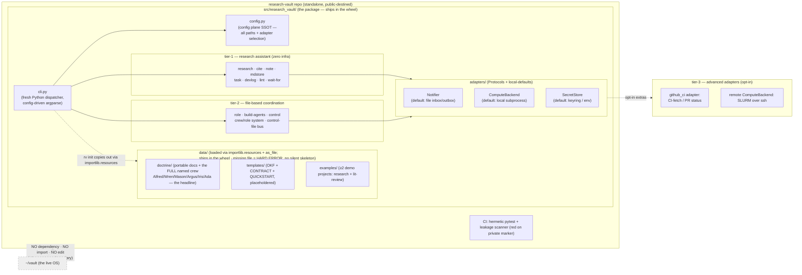
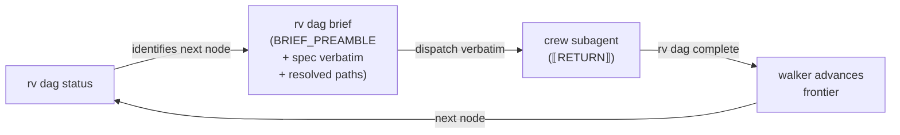
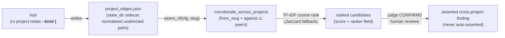
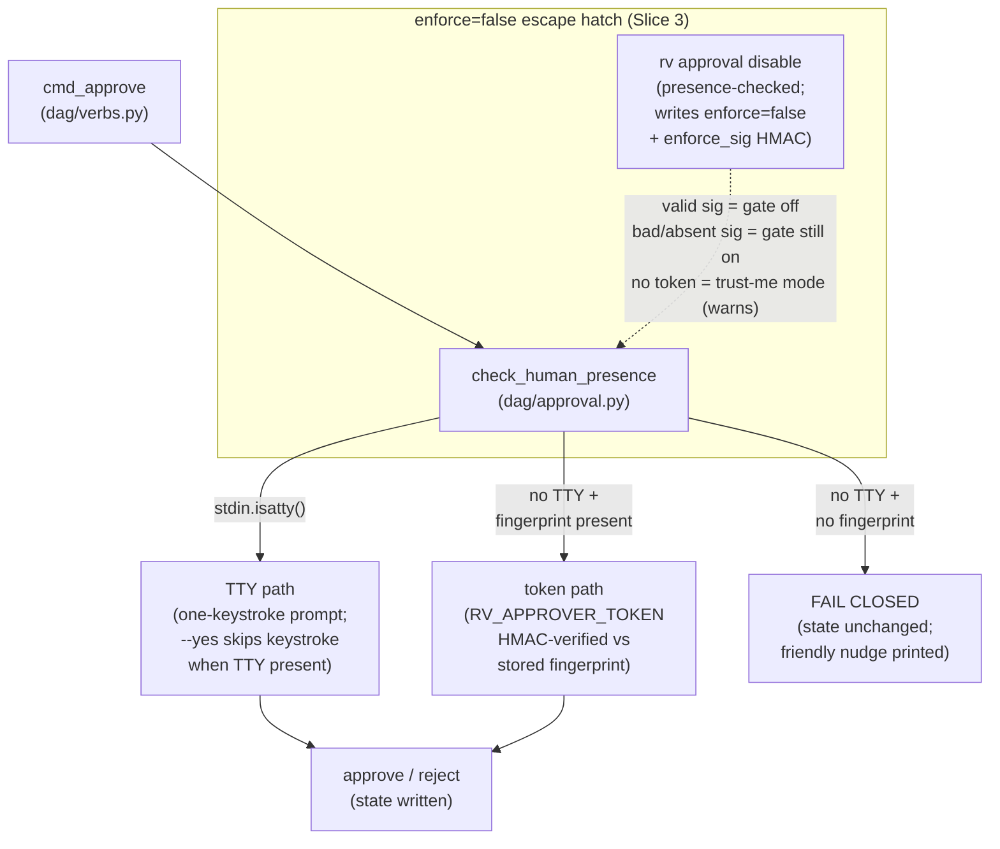
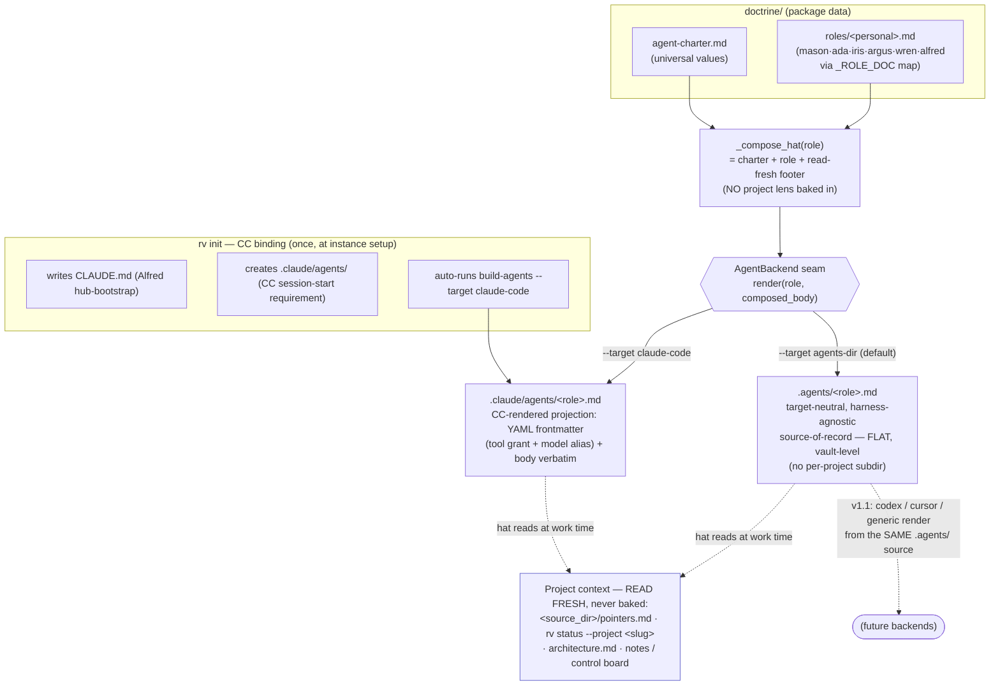

# Architecture — research-vault (Research Vault)

The architecture of record. Kept current with the code in the same change.
**Research Vault is a STANDALONE public OSS package** — built fresh, like any project. The live
`~/vault` is **NOT a dependency, NOT refactored, NOT imported** — that boundary is a v1 acceptance check.

## The standalone boundary



**Package-data layout.** `doctrine/`, `templates/`, and `examples/`
are **not** top-level repo boxes — they live under **`src/research_vault/data/`** *inside* the package,
so they ship in the wheel. `rv init` reads them via **`importlib.resources.files("research_vault") / "data"`
+ `as_file()`** (zipimport-safe: works from a regular install AND a zipped wheel). A missing data file is a
**HARD ERROR**, not a silently-degraded skeleton (surface, never silently drop).

## Tiers
| Tier | Surface | v1? |
|---|---|---|
| 1 — research assistant | research, cite, note, mdstore, task, devlog, lint, wait-for, dag + the loops (experiment, review, plan, wandb, compute, doctor) + the doctrine | YES |
| 2 — file coordination | status, role, build-agents, control, crew/role system, control-file bus, notify | YES |
| 3 — advanced (opt-in) | github CI fetch (`adapters/github_ci.py`), remote ComputeBackend / SLURM (`adapters/remote.py`); vcs multi-identity PR/merge | partial |

## OKF typed notes — 8 types (note.OKF_TYPES, the SSOT)
`note.OKF_TYPES` (`note.py`) is the frozen SSOT: **8 types** — `literature`, `concepts`, `methods`,
`experiments`, `findings`, `mocs`, `datasets`, `gaps`. Notes are **pointers, not
embeds** (a datasets note *points to* its artifact, never contains it).
**Scoping** is governed by `note.OKF_SHARED_TYPES = {"datasets"}` (`note.py`) — `datasets/` is the sole
**shared** cross-project root (lives in `cfg.datasets_root`); **all other 7 types are project-scoped**
(`cfg.project_notes_dir/<type>`). This split is imported, never duplicated (consumers: `wait_for` note-resolver,
`dag/verbs` scope-check).

## The loops layer — the generative research OS
Two subpackages, each a **DAG-driven loop** composed on the core walker/store + `spec:`/`reads:` grounding
manifest with **zero new DAG mechanism** (the standing constraint). Each carries a **config seam** (Ada-authored
prompt defaults + adopter override).

| Subpackage | Verb | What it does | Config seam |
|---|---|---|---|
| `review/` | `rv review new/expand/list/gap-scan/gap-scope/gap-close` | Pre-registered, **saturation-gated lit-review DAG**: Phase-1 (review-scope → `[HG:approve-protocol]` → review-search → review-snowball → `[HG:coverage-gate]`) with `_protocol.md` freeze (non-empty `counter-position` = L-2 anti-fishing gate) + internal saturation loop (forward cited-by + backward refs); **two-phase fan-out** via `rv review expand` after the coverage human-go. **Gap-driven pass**: `gap_scan.py` detects three typed gaps (knowledge_void / contradictory / evaluation_void); `gap-scan` is a **rejects-only screen** that writes `gaps/<id>.md` (8th OKF type, first-class lifecycle); `gap-scope` auto-authors a targeted Part-1 scope (question←claim, seed_queries, snowball_seeds) | `review_tips` + `style.py` |
| `plan/` | `rv plan check/tips` | Pre-registration **freeze** (`freeze.py`) + structural **shape-lint** (`check.py`): rule (a) branch-presence, rule (b) one-component-per-ablation, **rule (c) bare-id `covers:` convention** — run BEFORE `human-go-plan` | `plan_tips` + `style.py` |

**Dependency posture: 27-package research-toolkit core + GPU `[local]` extras; per-provider SDKs and
plotting libs are the adopter's own install.** The *research surface* carries a real dep-set:
`pip install research-vault` installs the **27-package core** — `anthropic` + **`litellm`**
(unified provider seam, primary) + `tiktoken` + `scikit-learn`; analysis (`datasets`, `pandas`, `numpy`,
`pyarrow`, `scipy`, `statsmodels`); eval (`inspect-ai`, `evaluate`, `sacrebleu`, `rouge-score`);
multilingual (`sentencepiece`, `sacremoses`, `langdetect`); integrations (`wandb`, `pyzotero`, `keyring`);
and harness utilities (`tenacity`, `tqdm`, `orjson`, `pydantic`, `jinja2`, `rich`, `python-dotenv`).
Per-provider SDKs (`openai`, `google-genai`, `mistralai`, `cohere`) and figure libs (`matplotlib`,
`seaborn`) are **NOT shipped** — the adopter installs them directly at their discretion. `litellm`
covers most providers without a per-provider SDK. The GPU-fragile Tier-2 stack (`torch`, `transformers`,
`accelerate`, `huggingface_hub`, `fasttext`, `lm-eval`, `bert-score`) is opt-in via `[local]`; serving
sub-extras `[serve-vllm]` (docs default) / `[serve-sglang]` are available.
`asta` is a documented external prerequisite for research corpus tooling — not a pip dep (may not be on PyPI).

**The `rv` CLI + every verb runs clean with toolkit absent** — all toolkit imports are guarded (lazy, only at
call sites), so `rv help`, `rv status`, `rv note`, `rv dag` and all other verbs work with `pip install
research-vault --no-deps`. This is enforced in CI via a hermetic bare-import test. Run `rv check` to see
the tier coverage matrix; run `rv bootstrap` if Tier-1 packages are missing.

Every loop obeys leakage-by-construction (no private markers in prompts/seams).

## Adapter Protocols (adapters/base.py)
| Adapter | Interface | Local-default (zero infra) | Advanced adapter |
|---|---|---|---|
| Notifier | `notify(msg, severity)` (+ optional `push_brief`) | file inbox/outbox (`state/inbox.jsonl` + `desk.md`) — **the ONLY impl; NO telegram/bridge anywhere** | — |
| ComputeBackend | `submit(job)->handle` · `status(handle)` | local subprocess; artifact-verify = file check | remote SLURM over ssh (`adapters/remote.py`) |
| SecretStore | `get(name)` · `set(name)` | `keyring` lib OR `$ENV` + gitignored dotfile (cross-platform) | macOS Keychain (later) |

The wait between submit and in-session verify is a backgrounded **`wait-for <condition>`** (§R) — one
main session + background shells, no daemon/poller/registry. Subagents submit-and-return; they never
block on an external job.

## Leakage-by-construction (the public-repo guarantee)
No dependency-direction tooth (there is no instance↔framework dependency). The guarantee is: the repo is
built fresh and contains no private data, enforced by (1) config-points-outward / zero hardcoded paths +
codenames; (2) a CI leakage scanner — private markers / secrets / non-template agent-memory → RED build;
(3) placeholdered + linted templates. Acceptance: `rv init` → a valid stranger-runnable instance.

## DAG walk protocol
The deterministic brief emitter (`dag/brief.py`) promotes the walk to a **4-step protocol** — repeat for every dispatch node:

```
1. rv dag status <run_id>           → identify the next node (PENDING; reads: paths verified)
2. rv dag brief <run_id> <node_id>  → emit the deterministic dispatch brief (BRIEF_PREAMBLE + spec + context)
3. dispatch the EMITTED brief       → send verbatim to the matching crew subagent; wait for RETURN
4. rv dag complete <run_id> <node_id>  → record SUCCEEDED/FAILED; walker advances the frontier
```

`build_brief(node, node_state, cfg, run_id, project_root, manifest_project) -> str` is **pure** (no I/O beyond
path-resolution helpers). Outputs are byte-identical given the same inputs. `BRIEF_PREAMBLE` is the fixed
structural layer every dispatch carries (role framing, instance boundary, anti-fabrication, `RETURN` schema)
— unremovable. The diagnose-first block fires only on retries
(`attempts > 0`), reusing `RETRY_DIAGNOSIS_DIRECTIVE`. Context block includes resolved absolute
`reads:` paths and `produces:` output paths — no re-transcription drift.



## Harness sub-sequence
The experiment loop inserts a **harness sub-sequence** per main BEFORE the run fires, gated by a dedicated
human-go node (`human-go-harness-main<k>`). Per main the sequence is:

```
<id>-main<k>-harness  →  <id>-main<k>-harness-review  →  [HG:human-go-harness-main<k>]
→ <id>-main<k>-run   →  …
```

`rv plan freeze-harness <run_id> <plan-note> --scope main<k> --harness-commit <sha>` writes the harness
SHA into the `harness_commits:` frontmatter field of the plan note and adds it as the **3rd canonical block**
of the K-3 covers-hash. This block is recomputed and re-verified at
`human-go-findings`, making harness-commit drift a reportable kind (`"harness-commit drift"` vs
`"covers edit"` vs `"retries edit"`). A plan note without `harness_commits:` produces the same 2-block
hash as before (fully backward-compatible).

The `harness_commits:` field uses the flat inline-list format: `harness_commits: [main1=<sha>, main2=<sha>]`.

## Cross-project reach seam
The cross-project seam (`project_edges.py` + `cross_project.py`) adds intentional reach between peer projects
without any intra-framework disclosure boundary (everything in research-vault is public by construction).



Key design decisions:
- **D1**: sidecar JSON at `state_dir/project_edges.json`; atomic write (tmp+replace).
- **D2**: undirected (pairs normalised to sorted order); `kind` + rationale required on declare.
- **D3**: `corroborate` requires `from_slug`; `against` ⊆ declared peers (enforced at call site, not just by convention).
- **D4**: judge-gated assert — TF-IDF rank NARROWS candidates, LLM judge CONFIRMS each, human reviews. Never auto-assert.
- **D5**: hub declares edges (`rv project relate`); crew reads via `peers_of`. Blanket-relating all projects forfeits the narrowing benefit — declare on genuine relatedness.

`rv project edges` surfaces the registry; `rv project edges --project <slug>` shows edges involving one project. `rv project relate <a> <b> --remove` prunes stale edges.

## Approval trust-boundary
`rv dag approve` / `rv dag reject` are gated at a single chokepoint (`cmd_approve` in `dag/verbs.py` → `check_human_presence` in `dag/approval.py`). The security property: **`security = stdin.isatty()`, full stop** — a dispatched subagent has no controlling TTY and is refused regardless of flags.



Key invariants:
- `--yes` is honoured **only** when a TTY is actually present — it is ignored for non-TTY callers.
- **A signed disable does NOT remove the token requirement**: when `enforce=false` + `token_fingerprint` provisioned, `check_human_presence` still resolves `RV_APPROVER_TOKEN` to verify `enforce_sig`. If the token is absent (KeyError), the disable is treated as `enforce=True` — the gate remains up. `rv approval disable` never grants tokenless approval.
- A raw toml edit (`enforce = false`, no `enforce_sig`) is **inert** when a token is provisioned.
- `rv approval setup` provisions the token + writes the fingerprint. `rv approval enable/disable/status` manage the gate; all are presence-checked.
- Doctrine: `data/doctrine/crew-cannot-self-approve.md`.

## Crew generation & the emit path
**One general, VAULT-LEVEL crew — not one crew per project.** Each hat is composed **`charter + role`**
only (`_compose_hat`, `build_agents.py`) and built **once at `rv init`**, flat. The old per-project
CONTRACT lens, the per-project hat-bake branch, the `_hub.lensByRole` selection, and the
first-project-pick namespacing hack are **all removed**. Project emphasis is **not baked** — it is
**read fresh** at work time. The 6 vault roles are `_VAULT_ROLES = DEFAULT_ROSTER + ["architect"]`
(`build_agents.py`).



**Two coexisting targets, one composed source.** `.agents/<role>.md` is the neutral source-of-record;
`.claude/agents/<role>.md` is the Claude-Code-rendered *projection* (both emitted by `rv build-agents`,
selected by `--target`). The `AgentBackend` seam (`render(role, composed_body) -> [(relpath, contents)]`)
is where v1.1 `codex`/`cursor`/`generic` backends slot in — same composed body, different path/format.

**CC tool-grant policy (least-privilege).** The `claude-code` projection stamps YAML
frontmatter per role: **coordinator-class** (architect) gets **no `Bash`** (structural, not
disciplinary); **doer-class** (engineer, designer) gets `Bash` + role tools; **reviewer** is read-only
(`Read, Bash, Grep, Glob` — no Write/Edit); **researcher** carries `WebSearch`/`WebFetch` for
retrieval-backed citations. Model values are **aliases only** (`sonnet`/`opus`/`haiku`) — never a
versioned ID (a private marker that would identify the instance); researcher + reviewer baseline **opus**.
